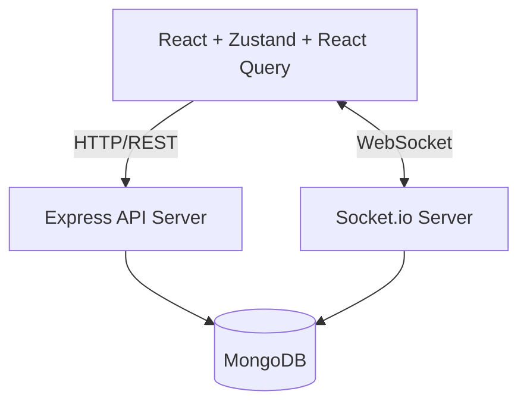

# CollabSpace Architecture

## System Overview
CollabSpace follows a standard client-server architecture with real-time updates.

## Key Components

1. **Frontend (Vite + React)**
   - **React Query**: Manages server state, caching, and optimistic updates.
   - **Zustand**: Manages client-side UI state (theme, sidebar visibility, selected workspace).
   - **Socket.io-client**: Listens for real-time changes to the active workspace.
   - **TailwindCSS**: UI styling and responsive design.

2. **Backend (Node + Express)**
   - **REST API**: Handles CRUD operations with JWT authentication and RBAC.
   - **Socket.io**: Broadcasts task changes to all clients currently connected to the same workspace.
   - **Mongoose**: Models data and handles complex queries like cursor pagination and aggregation.

3. **Database (MongoDB)**
   - Optimized indexes for fast queries (`workspaceId + status + order`).
   - Relational references between `Workspace`, `User`, `Task`, and `Comment`.
